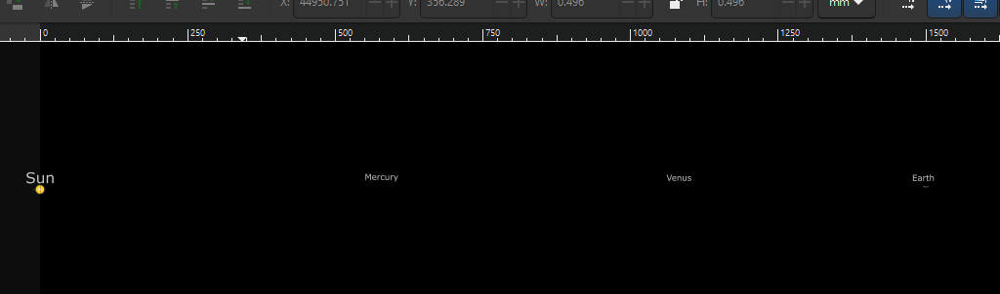
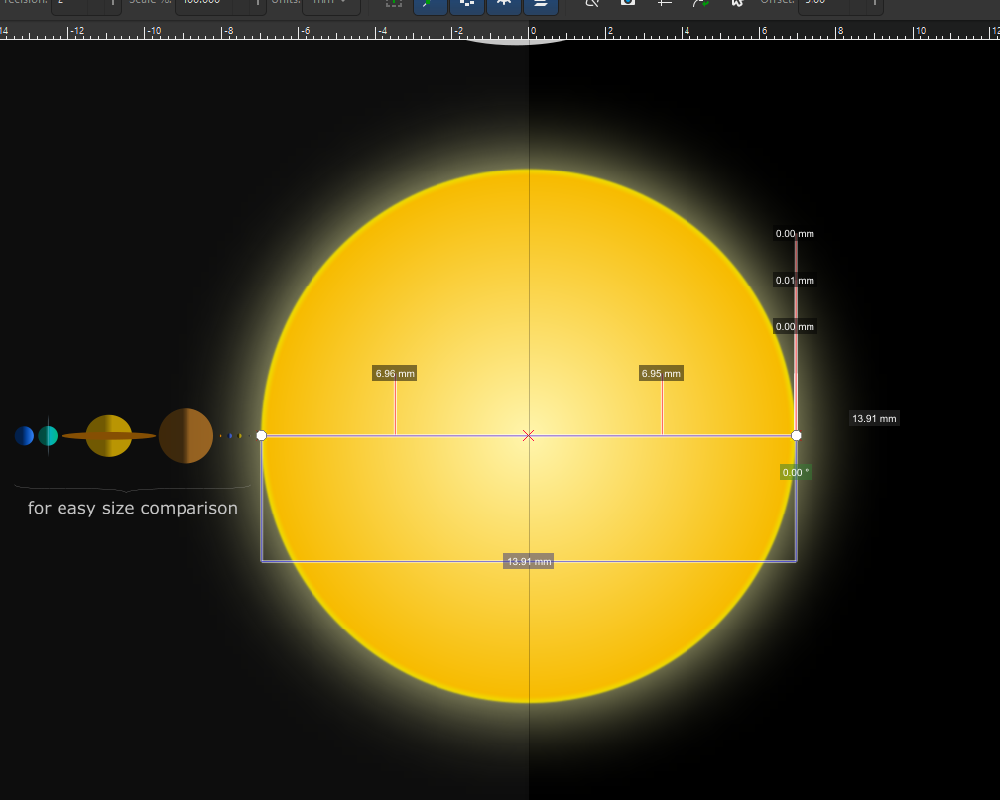

# SpaceVG - a representation of space in SVG files

## The What and the Why

I was looking for a to-scale representation of the Solar System to help grasp
the vast distances between objects of our neighborhood. While there are
countless descriptions, illustrations, artist representations, videos, etc. of
its size, I couldn't find a simple way to visualize it all and possibly
navigate this space for a better sense of its astronomical scale.

I decided to draw my own. The SVG format seemed a natural choice which had
a number of benefits.

## Content

So there we have it. The file [SolarSystem.svg](./SolarSystem.svg) is a
to-scale representation of the Solar System that includes the Sun and the eight
planets (Mercury to Neptune). Other objects are not included in this first
version, except Earth's Moon.

The SVG file is about 45000 units wide. Unit used at file creation is the
millimeter. Each unit represents 100000 kilometers. This was the best
compromise I could find to properly represent distances and sizes without going
over the top regarding image dimensions. For instance, Earth is about 12600 km
in diameter, which is 0.126 mm in the file. Ten millimeters would be 1 million
kilometers in the real world. Neptune lies at around 4.49 billion kilometers
from the Sun, hence the width mentioned above.

The Sun (its center) is at pixel/millimeter 0 (far left), so most SVG viewers
will crop half of the Sun and hide everything positioned left of its center.
See [Using the file](#using-the-file) below. This decision was made to position
objects easily (distance from the Sun corresponds to their x coordinate).

On the left of the Sun I duplicated all planets to show how they compare to
each other easily (as with most representations found around the web and
literature). The Solar System expands on the right of the Sun.

All objects are aligned on a single flat plane (angle of 0 degree), so the
correct inclination of their orbital plane in regards to the the Sun is not
represented here.

To make life easier in finding objects in the SVG, a much larger label was
added above each.

## Using the file

For the best experience, open the SVG file with a proper SVG editor, i.e. any
that can handle extreme zoom levels (25000%+ to 1%). Inkscape is a good one --
also free, open source and cross-platform.

Browsers can open the file, but won't display it properly (they can't display
contents outside the SVG page/left of the left-most boundary and have limited
max zoom levels such as 300-500%).

In Inkscape, it is easy to navigate using mouse scrolls, and the Shift and Ctrl
keys to scroll up/down, left/right and zoom in/out. If you're like me, you'll
be amazed how long you have to scroll between planets, or zoom in to find them.

